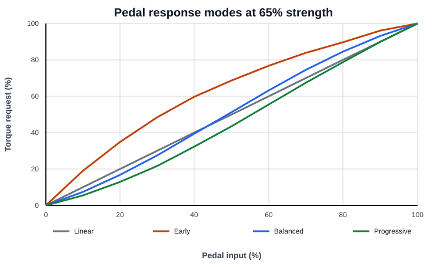

# VCU Operator Guide

Target: STM32F407VET6

Firmware identifier: `vcu-safety-remediation-2026-08-28`

## Purpose

The command interface provides read-only vehicle diagnostics and controlled service visibility. It does not provide a command to force torque, bypass a fault, or disable the safety supervisor.

## Connecting

1. Connect the laptop to the VCU USB interface.
2. Open the assigned serial port at 115200 baud, 8 data bits, no parity, 1 stop bit.
3. Send a carriage return.
4. Enter `help` to display the command list.

The USB CDC class must be enabled and connected to `VCU_USB_CDC_Receive()` for keyboard input to reach the CLI.

## Command status

The commands in this guide are implemented in the current firmware unless marked as planned. Output is timestamped and uses stable uppercase record names such as `STATUS`, `HEALTH`, `PEDAL`, and `CONFIG`.

## Commands

| Command | Function |
|---|---|
| `help` or `?` | Display the command summary. |
| `help <command>` | Display details for one command. |
| `version` | Display the firmware identifier and target MCU. |
| `status` | Display the car state, RTD state, pedal values, active faults, and inverter-frame freshness. |
| `health` | Display a one-line software health result and safety-input summary. |
| `self-test` | Check task handles, queues, ADC range, and runtime configuration. |
| `inspection` | Display the safety inputs and current torque-permission result. |
| `faults` | Display active safety and inverter fault status. |
| `io` | Display digital inputs, outputs, and raw ADC values. |
| `sensors` | Display the current raw input values once. |
| `can` | Display CAN bitrate, queue depth, dropped frames, TX errors, and bus-off count. |
| `bms status` | Display BMS link, layout, and last command acknowledgement. |
| `bms summary show` | Display the latest decoded BMS values. |
| `bms config show` | Display the cached summary layout. |
| `bms config read` | Request the committed layout from the BMS. |
| `bms signals` | List signals allowed in custom summaries. |
| `storage` | Display SD-card ownership, active log, and pending log records. |
| `reset-cause` | Display reset flags recorded by the MCU. |
| `tasks` | Display the state of each FreeRTOS task. |
| `pedal show` | Display the pedal-response mode, strength, raw pedal, shaped pedal, and torque command. |
| `pedal preview` | Display the response table from zero to full pedal. |
| `pedal mode <mode>` | Select `linear`, `early`, `balanced`, or `progressive` response. |
| `pedal strength <0-100>` | Set the selected curve strength. Zero is linear; 100 is the full selected curve. |
| `config show` | Display the active runtime configuration. |
| `config validate` | Check configuration ranges. |
| `service begin` | Enable the bounded service-mode state while `IDLE`; task suspend/resume remains disabled in the vehicle build. |
| `service status` | Display service-mode state and remaining time. |
| `service end` | Disable service mode. |
| `reboot confirm` | Reset the VCU only when the vehicle is in `IDLE`. |
| `watch sensors` | Enable periodic raw-input output. |
| `watch off` | Disable periodic output. |

## BMS telemetry configuration

The VCU reads the BMS `0x6XX` telemetry namespace and requests the active
five-second summary layout at boot. Layout changes require service mode and a
staged transaction:

```text
service begin
bms config begin
bms summary count 3
bms summary slot 0 format state soc pack_voltage pack_current
bms summary slot 1 min_cell max_cell max_temperature faults_low16
bms summary slot 2 active_faults latched_faults
bms config validate
bms config commit
bms config save
```

Wait for each acknowledgement before the next edit; `bms status` shows the
last opcode, transaction, and result. Commit changes runtime telemetry. Save
persists it only when BMS charge and discharge outputs are inactive. These
commands cannot modify BMS safety limits or outputs.

## Input editing

- Carriage return or line feed submits a command.
- Backspace deletes the previous character.
- Commands longer than 95 characters are rejected.

## Service mode

Service mode is retained for bounded bench diagnostics:

```text
service begin
service status
service end
```

The legacy `<task_name>=0` and `<task_name>=1` syntax is rejected because runtime task suspension can invalidate watchdog and safety assumptions. A separate bench-only build would require a documented test purpose and independent review before re-enabling it.

## Pedal response

APPS plausibility is checked before the response curve is applied. The response curve changes the torque request only after both pedal channels agree.

- `linear` preserves the original linear response.
- `early` increases torque request quickly at low pedal and tapers toward full pedal.
- `balanced` provides a moderate S-shaped response.
- `progressive` provides finer low-pedal control and more response near full pedal.

The commissioning default is `linear` at zero curve strength. These settings are runtime-only and return to defaults after reset. Tune them with the driven wheels removed, then validate launch behavior, low-speed control, the torque rise limit, and full-pedal torque on the vehicle.

Pedal configuration changes are accepted only while the car state is `IDLE`. The command interface can still display and preview the active curve in other states.

The early-ramp curve is not automatically safer or faster. Driver preference, tire grip, motor torque, and pedal travel must be validated with logged testing.



The graph shows normalized torque request before the `MAX_TORQUE` limit is applied. The exact active table is always available through `pedal preview`.

Example tuning sequence:

```text
service status
pedal show
pedal mode early
pedal strength 65
pedal preview
config validate
```

Use the sequence while the car is `IDLE`. Do not tune pedal response with the tractive system energized.

## Interpreting safety status

Torque is permitted only when all of the following are true:

- State is `ENABLE`.
- TSMS input is healthy.
- BMS input is healthy.
- APPS is valid.
- BPPS is valid.
- A recent inverter fault-status CAN frame has been received.
- No inverter fault bits are active.

The `inspection` command reports the VCU software view. It does not prove that the physical shutdown circuit, BSPD, AMS, IMD, inertia switch, AIRs, or indicator wiring is compliant. Those functions must be tested on the vehicle.

## Recommended pre-drive sequence

1. With the tractive system disabled, run `version`.
2. Run `self-test`, `config validate`, and `health`.
3. Run `inspection` and confirm torque is inhibited.
4. Run `status`, `pedal show`, `io`, `can`, and `storage`.
5. Test each shutdown and plausibility input using the team's approved high-voltage procedure.
6. Test the RTD sound, Ready-to-Move hardware, and tractive-system status indicators.
7. Verify CAN loss inhibits torque.
8. Verify SD-card removal and USB disconnect do not compromise control timing.

## Fault response

If the VCU reports an unexpected fault:

1. Keep the tractive system disabled.
2. Save the output of `status`, `inspection`, `faults`, `io`, `can`, and `reset-cause`.
3. Preserve the SD-card log.
4. Correct the physical or software cause.
5. Repeat the pre-drive sequence.

Faults are not cleared by the CLI. Reset and recovery behavior must follow the vehicle's electrical safety procedure.

## Planned extensions

These features should be added only with the supporting firmware infrastructure:

- `logs list` and `logs info`: require synchronized SD-card access so the logger and CLI cannot use FatFs concurrently.
- `format json`: requires a separate CLI output path so machine-readable output does not enter the SD log stream.
- `config save`: requires CRC-protected, versioned flash storage with rollback after interrupted writes.
- `events`: requires a bounded event history for state changes, faults, resets, and CAN failures.
- `time get` and `time set`: require RTC configuration and a defined time-validity policy.

USB mass-storage ownership of the SD card is disabled in the vehicle build to prevent concurrent filesystem access. Retrieve files with the vehicle de-energized using a separate card reader, and use the text commands in this guide for diagnostics.
